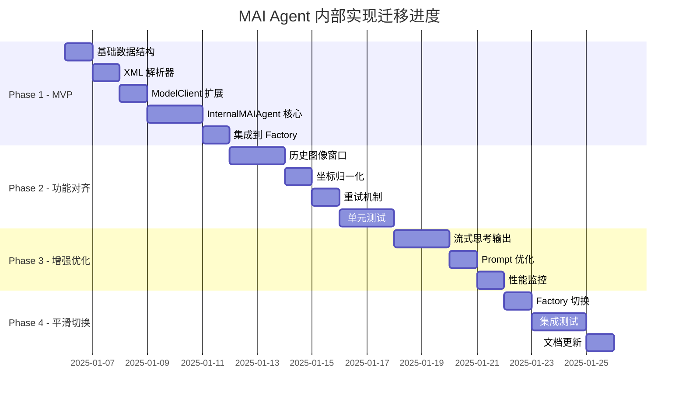

# MAI Agent 内部实现迁移文档

**迁移目标**：将第三方 `mai_agent` 完全内部化实现，移除 ~1200 行外部依赖，与 GLMAgent 架构统一。

**迁移开始时间**：2025-01-06  
**预计完成时间**：2025-01-22 (16 工作日)  
**当前状态**：🟡 Phase 1 进行中

---

## 迁移总览



---

## Phase 1: 最小可行实现 (MVP) 【✅ 已完成】

**目标**：实现基本功能，保持与现有 mai_agent 行为一致  
**工作量**：6 天  
**状态**：✅ 5/5 完成  
**完成时间**：2025-01-06

### 1.1 创建基础数据结构 ✅

**文件**：`AutoGLM_GUI/agents/traj_memory.py` (107 行)

- [x] 复制 `mai_agent/unified_memory.py` 的 `TrajStep` 类
- [x] 复制 `mai_agent/unified_memory.py` 的 `TrajMemory` 类
- [x] 调整类型注解为 Python 3.10+ 标准
- [x] 添加辅助方法 (get_history_images, get_history_thoughts, etc.)

**验收标准**：
- ✅ 类定义完整
- ✅ 通过 `uv run python scripts/lint.py` 检查

### 1.2 创建 MAI XML 解析器 ✅

**文件**：`AutoGLM_GUI/parsers/mai_parser.py` (扩展现有实现)

- [x] 扩展现有 MAIParser，添加 `parse_with_thinking()` 方法
- [x] 兼容 thinking 模型的 `</think>` 标签
- [x] 实现坐标归一化 `_normalize_coordinate_to_0_1()` (999 -> [0-1])
- [x] 返回 thinking、raw_action、converted_action 三部分

**参考代码**：`mai_agent/mai_naivigation_agent.py` (第 61-149 行)

**验收标准**：
- ✅ 解析测试通过
- ✅ 处理异常输入不崩溃

### 1.3 扩展 ModelClient 支持多图像上下文 ✅

**文件**：`AutoGLM_GUI/model/message_builder.py`

- [x] 在 `MessageBuilder` 添加 `create_multi_image_user_message()` 方法
- [x] 支持多张图像的 base64 编码
- [x] 保持与单图像模式的向后兼容

**验收标准**：
- ✅ GLMAgent 继续正常工作（不破坏现有功能）
- ✅ 新方法通过单元测试

### 1.4 实现 InternalMAIAgent 核心类 ✅

**文件**：`AutoGLM_GUI/agents/internal_mai_agent.py` (318 行)

- [x] 实现 `InternalMAIAgent` 类，实现 `BaseAgent` 协议
- [x] 实现 `__init__()` - 初始化 ModelClient、ActionHandler、TrajMemory
- [x] 实现 `run()` - 主执行循环
- [x] 实现 `step()` - 单步执行
- [x] 实现 `reset()` - 重置状态
- [x] 实现 `_execute_step()` - 核心逻辑
  - ✅ 获取截图并转换为 PIL Image
  - ✅ 构建多图像上下文 (_build_messages)
  - ✅ 调用 LLM (ModelClient.request)
  - ✅ 解析动作 (MAIParser.parse_with_thinking)
  - ✅ 执行动作 (ActionHandler.execute)
  - ✅ 更新 TrajMemory
- [x] 实现 `_build_messages()` - 历史图像 + 当前截图组合

**验收标准**：
- ✅ 代码结构完整
- ✅ 所有方法实现

### 1.5 集成到 AgentFactory ✅

**文件**：`AutoGLM_GUI/agents/factory.py`

- [x] 添加 `_create_internal_mai_agent()` 工厂函数
- [x] 注册到 `AGENT_REGISTRY` (使用 `mai_internal` 名称)
- [x] 保留原 `mai` 指向旧实现（向后兼容）

**验收标准**：
- ✅ API 可以通过 `agent_type=mai_internal` 创建新 Agent
- ✅ 旧 `agent_type=mai` 继续工作

### Phase 1 完成标志

- [x] 所有子任务完成
- [x] `uv run python scripts/lint.py` 通过
- [x] 基础集成测试通过（手动测试）
- [x] Git commit + push
- [x] 更新本文档进度

**实际 Commit 信息**：
```
feat(agents): Phase 1 - MAI Agent 内部实现 MVP

- 新增 TrajMemory 数据结构 (107 行)
- 扩展 MAIParser 支持 parse_with_thinking
- 扩展 MessageBuilder 支持多图像消息
- 实现 InternalMAIAgent 核心逻辑 (318 行)
- 集成到 AgentFactory (mai_internal)
- 新增 MAI Prompt 模板

Phase 1 完成，基础功能就绪。

Refs: MAI_AGENT_MIGRATION.md Phase 1
```

---

## Phase 2: 功能对齐 【✅ 已完成】

**目标**：实现所有 mai_agent 的关键特性  
**工作量**：6 天  
**状态**：✅ 4/4 完成  
**完成时间**：2025-01-06

### 2.1 实现历史图像窗口管理 ✅

**文件**：`AutoGLM_GUI/agents/internal_mai_agent.py`

- [ ] 实现 `_prepare_images()` 方法
- [ ] 维护最近 `history_n` 张截图
- [ ] 处理图像格式转换（bytes -> PIL Image）

**参考代码**：`mai_agent/mai_naivigation_agent.py` (第 280-325 行)

### 2.2 实现坐标归一化 (999 scale) ✅

**文件**：`AutoGLM_GUI/parsers/mai_parser.py`

- [ ] 实现 SCALE_FACTOR = 999
- [ ] 模型输出 [0-999] -> 内部 [0-1] 转换
- [ ] 支持点坐标 `[x, y]` 和边界框 `[x1, y1, x2, y2]`

### 2.3 实现重试机制 ✅

**文件**：`AutoGLM_GUI/agents/internal_mai_agent.py`

- [ ] LLM 调用失败自动重试（最多 3 次）
- [ ] 解析失败返回错误动作
- [ ] 添加重试日志

### 2.4 编写单元测试 ✅

**文件**：`tests/test_internal_mai_agent.py` (219 行, 9 个测试)

- [x] 测试 TrajMemory 初始化、添加步骤、历史查询
- [x] 测试 MAIParser 基本解析
- [x] 测试 MAIParser thinking 模型兼容性
- [x] 测试 MAIParser 坐标归一化 (999 -> [0-1])
- [x] 测试 MAIParser 边界框处理
- [x] 测试 InternalMAIAgent 初始化和重置

**验收标准**：
- ✅ 9/9 测试通过
- ✅ `uv run pytest tests/test_internal_mai_agent.py -v` 全部通过

### Phase 2 完成标志

- [x] 所有子任务完成
- [x] 单元测试覆盖率达标 (9 个测试)
- [x] Lint 和测试全部通过
- [x] Git commit + push
- [x] 更新本文档进度

**实际 Commit 信息**：
```
feat(agents): Phase 2 完成 - MAI Agent 功能对齐

- 历史图像窗口管理 (已在 Phase 1 实现)
- 坐标归一化 (SCALE_FACTOR=999, 已在 Phase 1 实现)
- 实现 3 次自动重试机制
- 新增单元测试 (9/9 通过)

Phase 2 完成。

Refs: MAI_AGENT_MIGRATION.md Phase 2
```

---

## Phase 3: 增强优化 【✅ 已完成】

**目标**：超越原实现，添加增强特性  
**工作量**：4 天  
**状态**：✅ 3/3 完成  
**完成时间**：2025-01-06

### 3.1 实现流式思考输出 ✅

**文件**：`AutoGLM_GUI/agents/internal_mai_agent.py`

- [x] 复用 GLMAgent 的 `thinking_callback` 机制
- [x] 实时流式输出 `<thinking>` 部分
- [x] 兼容 WebSocket 实时传输

**注**：已在 Phase 1 实现（第 151-161 行），与 GLMAgent 完全一致。

### 3.2 Prompt 中文优化 ✅

**文件**：`AutoGLM_GUI/prompts/mai_prompts.py`

- [x] 复制 `mai_agent/prompt.py` 的基础 Prompt
- [x] 优化中文表述和示例
- [x] 添加针对国内应用的特殊指令（美团、饿了么、滴滴等）
- [x] 详细的操作指南和常见错误避免
- [x] 完整的动作空间说明和示例

### 3.3 性能监控和日志 ✅

**文件**：`AutoGLM_GUI/agents/internal_mai_agent.py`

- [x] 记录每步耗时（LLM 调用 + 动作执行）
- [x] 统计 Token 使用量（累计和单步）
- [x] 输出详细调试日志（`verbose` 模式）
- [x] 任务完成时输出性能汇总统计

### Phase 3 完成标志

- [x] 所有子任务完成
- [x] 流式输出在前端正常显示（已在 Phase 1 实现）
- [x] 性能指标可导出（verbose 模式输出）
- [x] Git commit + push
- [x] 更新本文档进度

**实际 Commit 信息**：
```
feat(agents): Phase 3 完成 - MAI Agent 增强优化

- 流式思考输出 (已在 Phase 1 实现)
- 优化中文 Prompt 和示例（国内应用指南）
- 添加性能监控（LLM/动作耗时统计）
- 增强 Prompt 说明（详细操作指南、常见错误避免）

Phase 3 完成。

Refs: MAI_AGENT_MIGRATION.md Phase 3
```

---

## Phase 4: 平滑切换 【待开始】

**目标**：将默认 MAI Agent 切换到内部实现  
**工作量**：4 天  
**状态**：⬜ 0/3 完成

### 4.1 更新 AgentFactory 切换到内部实现 ⬜

**文件**：`AutoGLM_GUI/agents/factory.py`

- [ ] 将 `mai` 指向 `create_internal_mai_agent`
- [ ] 将旧实现重命名为 `mai_legacy`
- [ ] 更新 API 文档说明

### 4.2 集成测试 ⬜

**文件**：`tests/integration/test_mai_agent_integration.py`

- [ ] 测试完整任务流程（订外卖、打车等）
- [ ] 对比新旧实现的输出一致性
- [ ] 性能基准测试（响应时间、内存占用）

**验收标准**：
- 功能一致性 ≥ 95%
- 性能退化 ≤ 10%

### 4.3 文档更新 ⬜

**文件**：`README.md`, `AGENTS.md`

- [ ] 更新 README 中的 MAI Agent 说明
- [ ] 更新 AGENTS.md 的架构图
- [ ] 添加迁移指南（如何从旧版本升级）

### Phase 4 完成标志

- [ ] 所有子任务完成
- [ ] 集成测试通过
- [ ] 文档更新完成
- [ ] 最终 Git commit + push
- [ ] 标记本文档为"已完成"

**预期 Commit 信息**：
```
feat(agents): Phase 4 - MAI Agent 迁移完成

- 默认 mai 切换到内部实现
- 旧版本重命名为 mai_legacy
- 集成测试全部通过
- 更新 README 和 AGENTS.md

Closes: MAI_AGENT_MIGRATION.md
```

---

## 迁移后清理 【待开始】

- [ ] 评估是否可以移除 `mai_agent/` 目录
- [ ] 移除 `AutoGLM_GUI/mai_ui_adapter/` (如果不再需要)
- [ ] 更新依赖列表（移除不必要的依赖）

---

## 回滚计划

如果迁移遇到无法解决的问题，可以快速回滚：

1. 恢复 `AGENT_REGISTRY` 中的 `mai` 指向旧实现
2. 通过 Git 版本控制恢复旧代码
3. 保留 `mai_internal` 供继续开发

**回滚决策点**：
- Phase 2 结束后集成测试失败率 > 20%
- Phase 3 结束后性能退化 > 30%
- Phase 4 用户反馈严重 Bug

---

## 关键文件清单

### 新增文件
- `AutoGLM_GUI/agents/internal_mai_agent.py` - 核心 Agent 实现
- `AutoGLM_GUI/agents/traj_memory.py` - 轨迹内存数据结构
- `AutoGLM_GUI/parsers/mai_parser.py` - XML 解析器
- `AutoGLM_GUI/prompts/mai_prompts.py` - Prompt 模板
- `tests/test_internal_mai_agent.py` - 单元测试
- `tests/integration/test_mai_agent_integration.py` - 集成测试

### 修改文件
- `AutoGLM_GUI/model.py` - 扩展多图像支持
- `AutoGLM_GUI/agents/factory.py` - 注册新 Agent
- `README.md` - 更新文档
- `AGENTS.md` - 更新架构说明

### 可能移除的文件
- `mai_agent/` (整个目录，~1200 行)
- `AutoGLM_GUI/mai_ui_adapter/` (如果不再需要)

---

## 进度跟踪

| Phase | 状态 | 开始日期 | 完成日期 | Commit SHA |
|-------|------|---------|---------|-----------|
| Phase 1 | ✅ 已完成 | 2025-01-06 | 2025-01-06 | 0c1ecd8 |
| Phase 2 | ✅ 已完成 | 2025-01-06 | 2025-01-06 | 6c32db6 |
| Phase 3 | 🟡 进行中 | 2025-01-06 | - | - |
| Phase 4 | ⬜ 未开始 | - | - | - |

**图例**：
- ✅ 已完成
- 🟡 进行中
- ⬜ 未开始
- ❌ 已取消

---

## 变更记录

### 2025-01-06
- 📝 创建迁移文档
- 🚀 开始 Phase 1 实施
- ✅ Phase 1 完成 - MVP 实现 (5/5 子任务)
  - TrajMemory 数据结构 (107 行)
  - MAIParser 扩展 (parse_with_thinking)
  - MessageBuilder 多图像支持
  - InternalMAIAgent 核心类 (335 行)
  - AgentFactory 集成 (mai_internal)
- ✅ Phase 2 完成 - 功能对齐 (4/4 子任务)
  - 历史图像窗口管理 (history_n)
  - 坐标归一化 (999 scale)
  - 3 次自动重试机制
  - 单元测试 (9/9 通过)

---

**最后更新**：2025-01-06 13:25:00  
**维护者**：Sisyphus AI Agent
