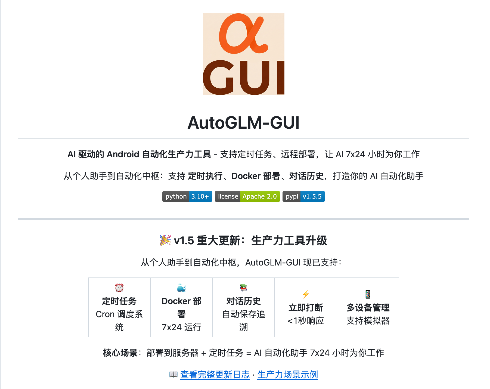
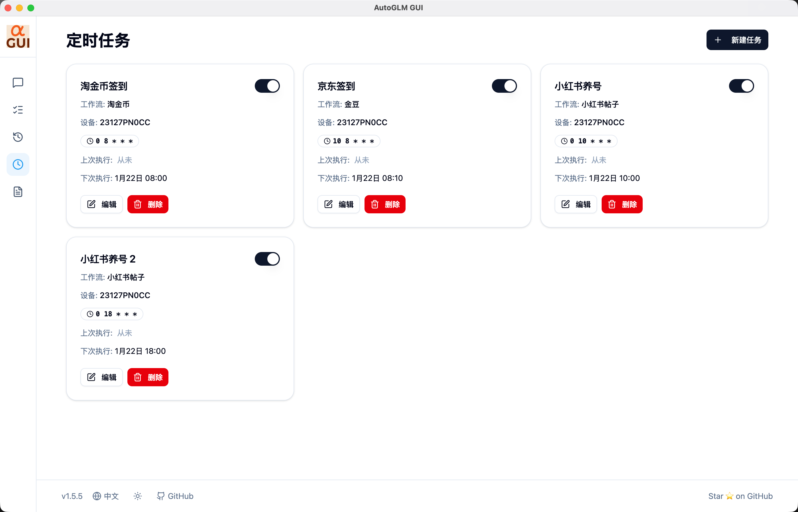
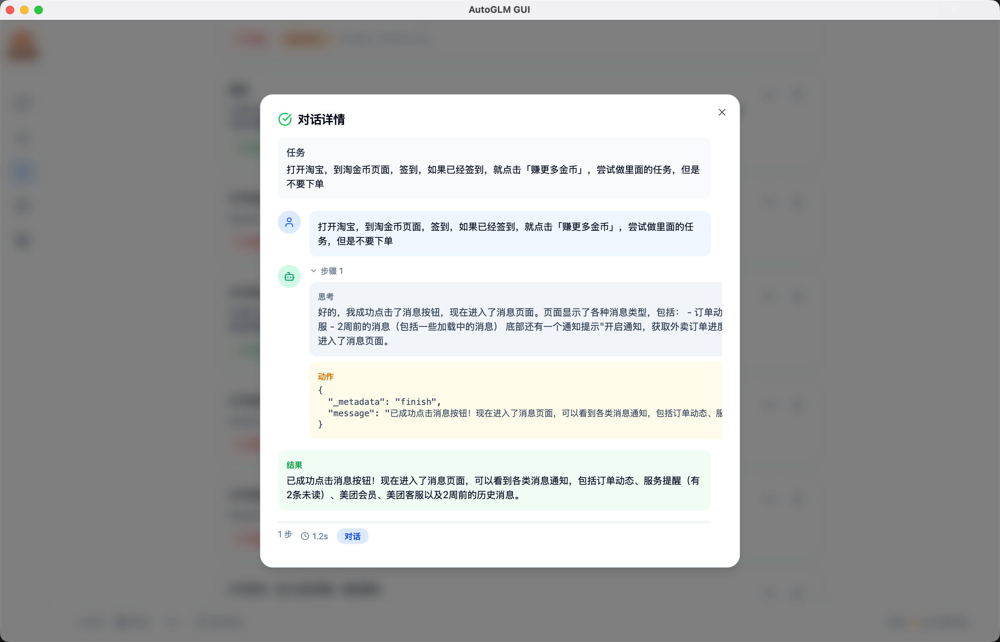
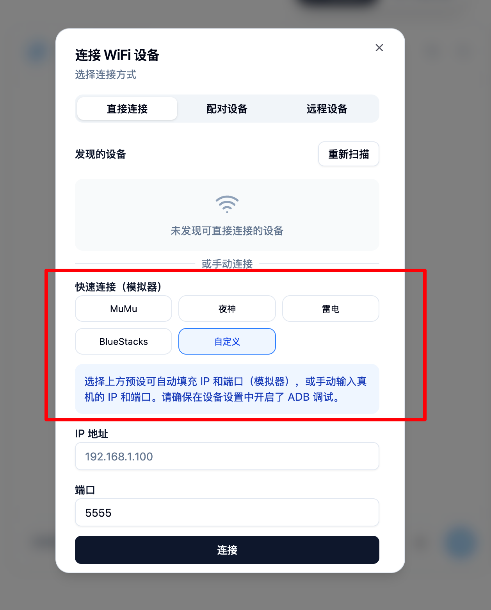

AutoGLM-GUI v1.5 正式发布 生产力升级：MCP 定时任务 docker 部署

AutoGLM-GUI v1.5 正式发布啦。这个版本主要聚焦在生产力场景，让 AI
自动化真正可以投入日常使用。




从 v1.4.1 到 v1.5.5，经过 65 个提交，新增了大量功能：
- 📅 定时任务系统
- 🐳 Docker 部署支持
- 💬 对话历史保存
- 📱 模拟器零配置直连
- 🔌 MCP 服务器集成

---
🎯 核心功能更新

1. 定时任务系统 - 自动化的自动化

现在可以设置定时任务，让 AI 自动执行重复性操作。比如：
- 每天早上 8 点自动打卡
- 每周定时清理应用缓存
- 定期执行数据同步操作



使用场景：
- 工作日自动处理固定流程
- 定期维护设备状态
- 批量任务的定时执行

---
1. Docker 部署 - 7×24 运行在服务器

一行命令部署到服务器，配合定时任务实现真正的无人值守：

docker run -p 8000:8000 ghcr.io/suyiiyii/autoglm-gui:main

特性：
- ✅ 支持 x86_64 和 ARM64 架构
- ✅ 开箱即用，无需配置环境
- ✅ 配合 ADB over Network 实现远程控制


实际场景：
你可以把 AutoGLM-GUI 部署在家里的 NAS 或者云服务器上，通过 ADB WiFi 连接手机，实现：
- 远程执行自动化任务
- 服务器端定时任务调度
- 多设备集中管理

---
1. 对话历史 - 所有任务都有记录

现在所有的对话和操作都会自动保存到本地数据库，支持：
- 📊 查看完整执行记录
- 🔍 检索历史对话
- 📈 统计任务执行情况



实用价值：
- 出问题时可以回溯完整执行过程
- 优化任务提示词的参考依据
- 任务执行日志的长期保存

---
4. 模拟器直连 - 开发环境零配置

Android 模拟器（Android Studio、雷电、夜神等）现在可以直接连接，无需任何配置：
- 🔌 自动检测本地模拟器
- ⚡ 无需 QR 码配对
- 🚀 即插即用




开发者友好：
如果你在开发环境测试自动化流程，现在可以直接用模拟器，省去真机配对的麻烦。

---
5. MCP 服务器 - 成为其他 AI 的工具

AutoGLM-GUI 现在内置了 MCP (Model Context Protocol) 服务器，可以作为工具被其他 AI
应用调用。

**工作原理**

MCP 服务器集成在 AutoGLM-GUI 的 FastAPI 应用中，通过 HTTP 协议提供服务。你需要先启动 AutoGLM-GUI 服务，然后其他 AI 应用就能通过 MCP 协议调用它的功能。

**提供的能力**

• chat(device_id, message) - 向设备发送自然语言任务
• list_devices() - 列出所有已连接的设备和状态

**使用示例**

场景 1：从 Claude Desktop 控制手机
```
你：帮我用手机打开微信
Claude：[调用 MCP chat 工具] → AutoGLM-GUI 执行 → 返回结果
```

场景 2：在 Cursor/Cline 中集成
```python
agent.run("帮我清理后台应用")
# → 自动调用 MCP 工具操作你的设备
```

场景 3：自定义 AI 工作流
- 定时任务触发 MCP 工具
- 多设备批量操作
- AI 决策调用手机操作

**配置方式**

首先启动 AutoGLM-GUI 服务：
```bash
autoglm-gui --base-url YOUR_API_ENDPOINT --port 8000
```

MCP 服务器端点为 http://localhost:8000/mcp（使用 SSE 传输协议）。

根据你使用的 MCP 客户端（Claude Desktop、Cursor、Cline 等），在配置文件中添加 MCP 服务器连接。具体配置方式请参考各客户端的 MCP 集成文档。
